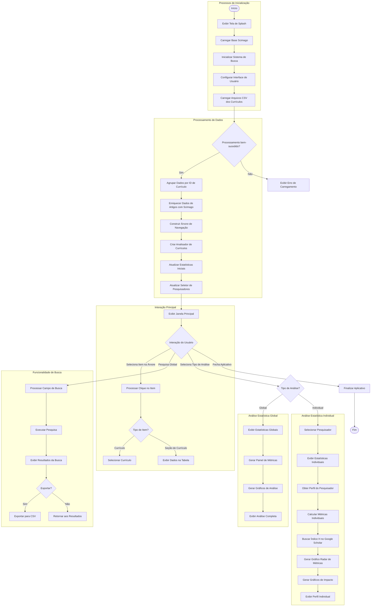

# Diagrama BPMN do Sistema de Visualização e Análise de Currículos

## Detalhamento dos Processos Principais

### 1. Processos de Inicialização
- **Início**: Ponto de entrada do aplicativo quando o usuário executa o programa
- **Exibir Tela de Splash**: Mostra tela de carregamento inicial com progresso
- **Carregar Base Scimago**: Carrega dados bibliométricos da base Scimago
- **Inicializar Sistema de Busca**: Prepara o mecanismo de busca de artigos
- **Configurar Interface**: Cria e organiza os elementos da interface do usuário
- **Carregar Arquivos CSV**: Lê os arquivos CSV dos currículos da pasta de saída

### 2. Processamento de Dados
- **Processamento bem-sucedido?**: Verifica se os dados foram carregados corretamente
- **Agrupar Dados por ID**: Organiza os dados por identificador de currículo
- **Enriquecer Dados de Artigos**: Adiciona métricas Scimago aos artigos publicados
- **Construir Árvore de Navegação**: Cria estrutura hierárquica para navegação nos currículos
- **Criar Analisador de Currículos**: Inicializa o componente responsável pelas análises estatísticas
- **Atualizar Estatísticas**: Calcula estatísticas iniciais para visualização
- **Atualizar Seletor de Pesquisadores**: Povoa o seletor com os nomes dos pesquisadores

### 3. Interação Principal
- **Exibir Janela Principal**: Mostra a interface completa ao usuário
- **Interação do Usuário**: Ponto de decisão para diferentes ações do usuário
- **Processar Clique**: Lida com interações na árvore de navegação
- **Verificar Tipo de Item**: Determina se é um currículo completo ou uma seção específica
- **Exibir Dados na Tabela**: Mostra os dados selecionados em formato tabular

### 4. Funcionalidade de Busca
- **Processar Campo de Busca**: Captura termos de busca inseridos pelo usuário
- **Executar Pesquisa**: Realiza busca nos dados conforme critérios especificados
- **Exibir Resultados**: Mostra os resultados em uma janela de diálogo
- **Exportar para CSV**: Permite salvar resultados em formato CSV

### 5. Análise Estatística Global
- **Exibir Estatísticas Globais**: Mostra métricas consolidadas de todos os pesquisadores
- **Gerar Painel de Métricas**: Cria cards com indicadores principais (total docentes, artigos, etc.)
- **Gerar Gráficos de Análise**: Produz visualizações como distribuição por área, impacto, tendências
- **Exibir Análise Completa**: Organiza e apresenta todos os elementos de análise

### 6. Análise Individual de Pesquisador
- **Selecionar Pesquisador**: Escolhe um pesquisador específico para análise
- **Obter Perfil do Pesquisador**: Recupera dados detalhados do pesquisador selecionado
- **Calcular Métricas Individuais**: Computa indicadores específicos para o pesquisador
- **Buscar Índice H**: Consulta o Google Scholar para obter Índice H do pesquisador
- **Gerar Gráfico Radar**: Cria visualização de métricas em formato de radar
- **Gerar Gráficos de Impacto**: Produz visualizações de evolução do impacto das publicações
- **Exibir Perfil Individual**: Apresenta análise completa do pesquisador selecionado